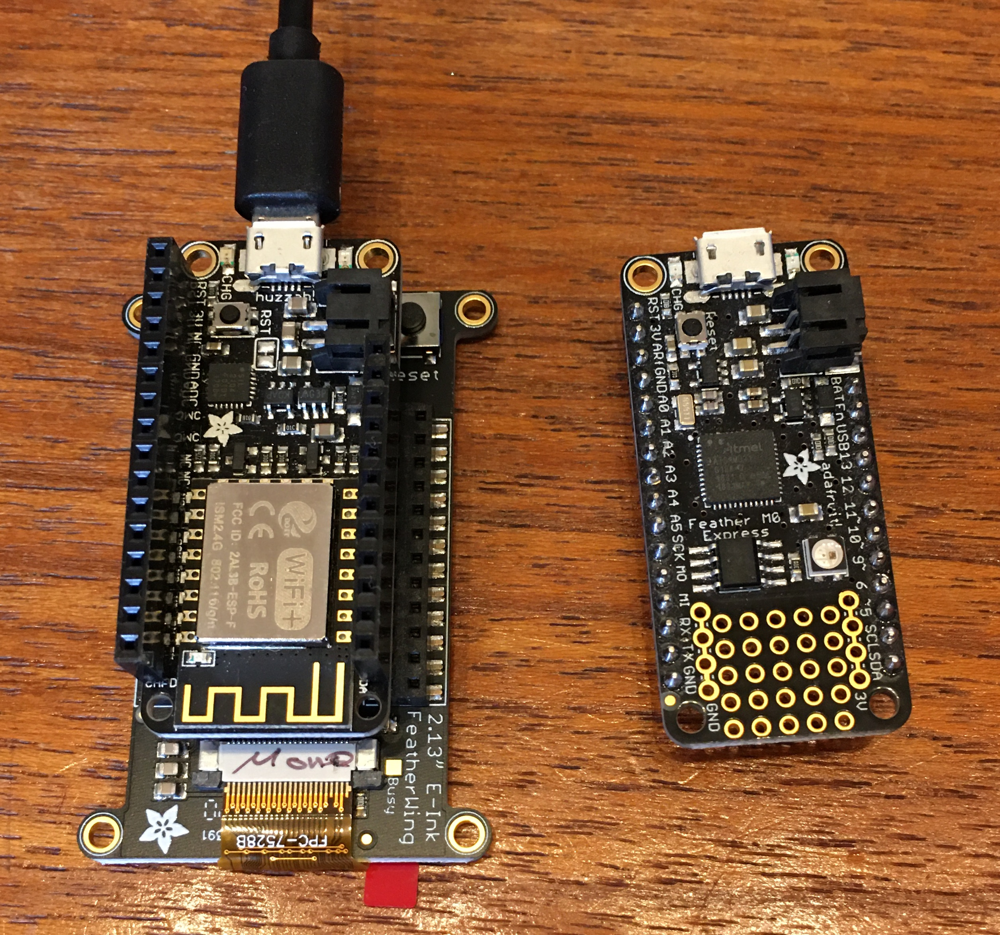
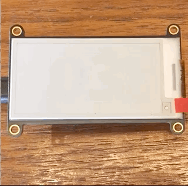

# ePaper displays

--
## GxEPD2 Library
Thanks to the [GxEPD2](https://github.com/ZinggJM/GxEPD2) library partical refresh can be achieved. This means you do not get the extrem flash moment during which the whole display switches between black and white.

## Microcontrollers

I had success with:
- [Adafruit Feather M0 Express](https://www.adafruit.com/product/3403)
- [Adafruit Feather HUZZAH with ESP8266](https://www.adafruit.com/product/2821)

I have not yet had success with:
- [Adafruit MagTag - 2.9" Grayscale](https://www.adafruit.com/product/4800)

## Fonts
New fonts can be imported thanks to this web app http://oleddisplay.squix.ch/

## Photos and Video

